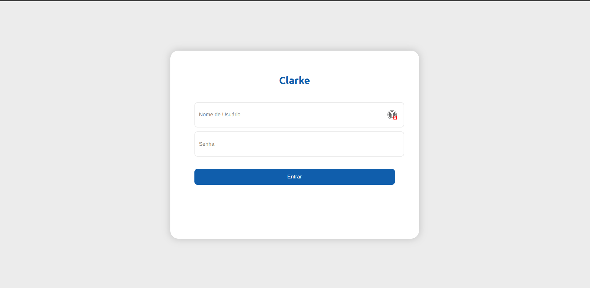
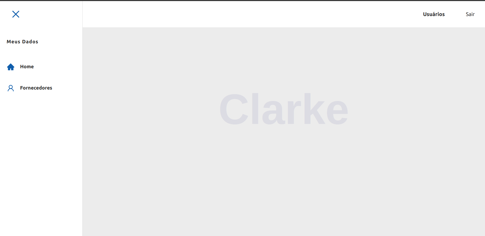
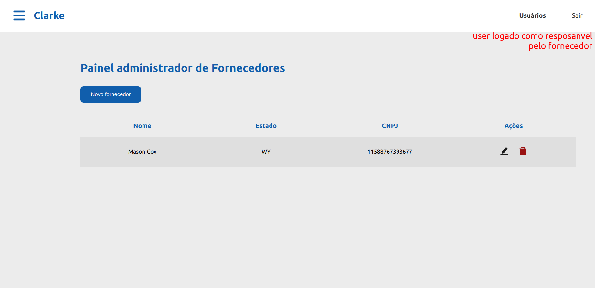
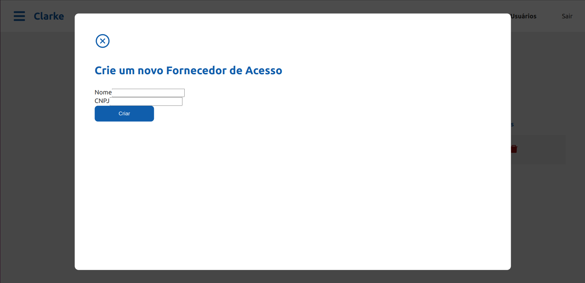

# Django_reactjs_docker_postgres

## Visão Geral do Projeto

- **[FEITO]** `docker-compose.yml` orquestrando container Docker.
- **[FEITO]** Docker para ambiente PostgreSQL, React.js e Django.
- **[FEITO]** Configuração e execução de cada ambiente com arquivo `entrypoint.sh`.
  - **[FEITO]** Criação e execução de migrações.
  - **[FEITO]** Distinção de ambiente de desenvolvimento, produção e testes.
- **[FEITO]** Arquivo `.env` para variáveis de ambiente.
- **[FEITO]** Script `wait-for-postgres.sh` que faz com que o Django espere o PostgreSQL responder antes de tentar conectar.
- **[FEITO]** Script `create_superuser_django.py` que automatiza a criação do superusuário do Django.
- **[FEITO]** Script `seed` para criar usuários fake.
- **[FEITO]** Script `seed` para criar `Clients`, `Suppliers`, `Contracts` e `ResponsibleCompany`.
- **[FEITO]** API REST CRUD para `Clients`, `Suppliers`, `Contracts`.
- **[FEITO]** Integração backend com banco de dados via `network` do `docker-compose.yml`.
- **[FEITO]** Integração backend com frontend (CORS).
- **[FAZER]** API REST CRUD para `ResponsibleCompany`.
- **[FAZER]** Model `ResponsibleClient` (usuário responsável pelo cliente).
- **[FEITO]** Páginas/telas de login, home, listagem de `Suppliers`, sidebar.
- **[FAZER]** Páginas/telas para `Client`, `Contracts` e `ResponsibleCompany`.
- **[FAZER]** Configuração do Nginx.
- **[FEITO]** Autenticação JWT no Django.
- **[FEITO]** Controle de permissões por grupo de acesso (admin, client, supplier).
- **[FAZER]** Testes automatizados no Django.
- **[FAZER]** Isolar as regras de negócio em uma cada separada
- **[FAZER]** Isolar cada model em um app (modulo) diferente

## Regras de Negócio

- O Cliente pode ser pessoa física (CPF) ou jurídica (CNPJ).
- O Fornecedor é sempre pessoa jurídica (CNPJ).
- Um Cliente pode receber energia de vários Fornecedores.
- Um Fornecedor pode ter vários Clientes.
- Um Cliente pode ter vários usuários responsáveis.
- Um Fornecedor pode ter vários responsáveis.
- Somente o responsável ou superadmin pode ver dados privados.
- O Cliente pode fazer cotação com vários Fornecedores.
- O Cliente pode ter vários contratos com Fornecedores e vice-versa.

## Fluxo do Usuário

1. O usuário deve criar uma conta, depois criar um Cliente ou um Fornecedor.
2. O usuário só pode alterar dados do Cliente ou Fornecedor do qual ele é responsável.
3. O usuário faz orçamento (filtro na tela).
4. O Cliente manifesta interesse em um Fornecedor criando um novo contrato.
5. O Fornecedor deve aceitar o contrato com o Cliente.
6. Após o contrato ser firmado, todo mês o sistema irá gerar uma cobrança do Cliente para debitar para o Fornecedor.

- Tela de Login
    - 
- Página Home
    - 
- Tela de fornecedores: 
    - 
- Tela de criar novo fornecedor
    - 


## Iniciando o Projeto

### 1. Arrumar Permissões nos Arquivos do Projeto

```bash
sudo chown -R $(whoami):$(whoami) .
```

### 2. crie o arquivo '.env' na raiz do projeto com base no '.env.example'

```bash
$ sudo docker-compose down -v
```

### 3. construindo as imagens e iniciando os serviços dos container 
```bash
$ sudo docker-compose up --build
```

### 4. caso queira criar um super usuário no django
```bash 
$ sudo docker-compose exec service_backend /bin/bash -c "python manage.py createsuperuser"
```

